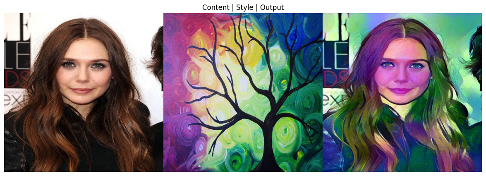

# Image-Style-Transform-model

Hello learners !!!

This is yet another Project I made, this time to learn more about Image processing, Deep learning and different Logics in ML

# Overview

This project implements **'Image Style Transfer'** using deep learning techniques to combine the content of one image with the artistic style of another. 

The model uses a pre-trained VGG19 model to apply artistic styles of one image to the contents of another image, the Model focuses on processing visually stunning blend of features for the Output image 

I have made sure the code can handle any image given, The images can be used from either your local device (by setting image path) or from the Internet (by setting URL)

Feel free to Use, Update the code or to make any contributions for the project

# Output

***Content | Style | Result***

  
  

